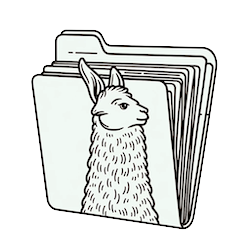

# llamafile



**llamafile lets you distribute and run LLMs with a single file ([blog post](https://hacks.mozilla.org/2023/11/introducing-llamafile/))**

Our goal is to make the "build once anywhere, run anywhere" dream come
true for AI developers. We're doing that by combining [llama.cpp](https://github.com/ggerganov/llama.cpp) 
with [Cosmopolitan Libc](https://github.com/jart/cosmopolitan) into one 
framework that lets you build apps for LLMs as a single-file artifact 
that runs locally on most PCs and servers.

First, your llamafiles can run on multiple CPU microarchitectures. We
added runtime dispatching to llama.cpp that lets new Intel systems use
modern CPU features without trading away support for older computers.

Secondly, your llamafiles can run on multiple CPU architectures. We do
that by concatenating AMD64 and ARM64 builds with a shell script that
launches the appropriate one. Our file format is compatible with WIN32
and most UNIX shells. It's also able to be easily converted (by either
you or your users) to the platform-native format, whenever required.

Thirdly, your llamafiles can run on six OSes (macOS, Windows, Linux,
FreeBSD, OpenBSD, and NetBSD). You'll only need to build your code once,
using a Linux-style toolchain. The GCC-based compiler we provide is
itself an Actually Portable Executable, so you can build your software
for all six OSes from the comfort of whichever one you prefer most for
development.

Lastly, the weights for your LLM can be embedded within your llamafile.
We added support for PKZIP to the GGML library. This lets uncompressed
weights be mapped directly into memory, similar to a self-extracting
archive. It enables quantized weights distributed online to be prefixed
with a compatible version of the llama.cpp software, thereby ensuring
its originally observed behaviors can be reproduced indefinitely.

## Binary Instructions

We provide example binaries that embed several different models. You can
download these from Hugging Face via the links below. "Command-line
binaries" run from the command line, just as if you were invoking
llama.cpp's "main" function manually. "Server binaries" launch a local
web server (at 127.0.0.1:8080) that provides a web-based chatbot.

| Model | Command-line binary | Server binary |
| --- | --- | --- |
| Mistral-7B-Instruct | [mistral-7b-instruct-v0.1-Q4_K_M-main.llamafile (4.07 GB)](https://huggingface.co/jartine/mistral-7b.llamafile/resolve/main/mistral-7b-instruct-v0.1-Q4_K_M-main.llamafile?download=true) | [mistral-7b-instruct-v0.1-Q4_K_M-server.llamafile (4.07 GB)](https://huggingface.co/jartine/mistral-7b.llamafile/resolve/main/mistral-7b-instruct-v0.1-Q4_K_M-server.llamafile?download=true) |
| LLaVA 1.5 | (Not provided because this model's features are best utilized via the web UI) | **[llava-v1.5-7b-q4-server.llamafile (3.97 GB)](https://huggingface.co/jartine/llava-v1.5-7B-GGUF/resolve/main/llava-v1.5-7b-q4-server.llamafile?download=true)** |
| WizardCoder-Python-13B | [wizardcoder-python-13b-main.llamafile (7.33 GB)](https://huggingface.co/jartine/wizardcoder-13b-python/resolve/main/wizardcoder-python-13b-main.llamafile?download=true) | [wizardcoder-python-13b-server.llamafile (7.33GB)](https://huggingface.co/jartine/wizardcoder-13b-python/resolve/main/wizardcoder-python-13b-server.llamafile?download=true) |

You can also also download *just* the llamafile software (without any
weights included) from our releases page, or directly in your terminal
or command prompt. This is mandatory currently on Windows.

```sh
curl -L https://github.com/Mozilla-Ocho/llamafile/releases/download/0.1/llamafile-server-0.1 >llamafile
chmod +x llamafile
./llamafile --help
./llamafile -m ~/weights/foo.gguf
```

### Gotchas

On macOS with Apple Silicon you need to have Xcode installed for
llamafile to be able to bootstrap itself.

On Windows, you may need to rename `llamafile` to `llamafile.exe` in
order for it to run. Windows also has a maximum file size limit of 4GB
for executables. The LLaVA server executable above is just 30MB shy of
that limit, so it'll work on Windows, but with larger models like
WizardCoder 13B, you need to store the weights in a separate file.

If you use zsh and have trouble running llamafile, try saying `sh -c
./llamafile`. This is due to a bug that was fixed in zsh 5.9+. The same
is the case for Python `subprocess`, old versions of Fish, etc.

On Linux `binfmt_misc` has been known to cause problems. You can fix
that by installing the actually portable executable interpreter.

```sh
sudo wget -O /usr/bin/ape https://cosmo.zip/pub/cosmos/bin/ape-$(uname -m).elf
sudo sh -c "echo ':APE:M::MZqFpD::/usr/bin/ape:' >/proc/sys/fs/binfmt_misc/register"
sudo sh -c "echo ':APE-jart:M::jartsr::/usr/bin/ape:' >/proc/sys/fs/binfmt_misc/register"
```

### GPU Support

On Apple Silicon, everything should just work if Xcode is installed.

On Linux, Nvidia cuBLAS GPU support will be compiled on the fly if (1)
you have the `cc` compiler installed, (2) you pass the `--n-gpu-layers
35` flag (or whatever value is appropriate) to enable GPU, and (3) the
CUDA developer toolkit is installed on your machine and the `nvcc`
compiler is on your path.

On Windows, that usually means you need to open up the MSVC x64 native
command prompt and run llamafile there, for the first invocation, so it
can build a DLL with native GPU support. After that, `$CUDA_PATH/bin`
still usually needs to be on the `$PATH` so the GGML DLL can find its
other CUDA dependencies.

In the event that GPU support couldn't be compiled and dynamically
linked on the fly for any reason, llamafile will fall back to CPU
inference.

## Source Instructions

Here's how to build llamafile from source. First, you need the cosmocc
toolchain, which is a fat portable binary version of GCC. Here's how you
can download the latest release and add it to your path.

```sh
mkdir -p cosmocc
cd cosmocc
curl -L https://github.com/jart/cosmopolitan/releases/download/3.1.1/cosmocc-3.1.1.zip >cosmocc.zip
unzip cosmocc.zip
cd ..
export PATH="$PWD/cosmocc/bin:$PATH"
```

You can now build the llamafile repository by running make:

```sh
make -j8
```

Here's an example of how to generate code for a libc function using the
llama.cpp command line interface, utilizing [WizardCoder-Python-13B](https://huggingface.co/TheBloke/WizardCoder-Python-13B-V1.0-GGUF/tree/main)
(license: [LLaMA 2](https://ai.meta.com/resources/models-and-libraries/llama-downloads/))
weights.

```sh
make -j8 o//llama.cpp/main/main
o//llama.cpp/main/main \
  -m ~/weights/wizardcoder-python-13b-v1.0.Q8_0.gguf \
  --temp 0 \
  -r $'```\n' \
  -p $'```c\nvoid *memcpy_sse2(char *dst, const char *src, size_t size) {\n'
```

Here's a similar example that instead utilizes [Mistral-7B-Instruct](https://huggingface.co/TheBloke/Mistral-7B-Instruct-v0.1-GGUF/tree/main) 
(license: [Apache 2.0](https://choosealicense.com/licenses/apache-2.0/)) weights.

```sh
make -j8 o//llama.cpp/main/main
o//llama.cpp/main/main \
  -m ~/weights/mistral-7b-instruct-v0.1.Q4_K_M.gguf \
  --temp 0.7 \
  -r $'\n' \
  -p $'### Instruction: Write a story about llamas\n### Response:\n'
```


Here's an example of how to run llama.cpp's built-in HTTP server in such
a way that the weights are embedded inside the executable. This example
uses [LLaVA v1.5-7B](https://huggingface.co/jartine/llava-v1.5-7B-GGUF/tree/main) (license: [LLaMA](https://github.com/facebookresearch/llama/blob/main/LICENSE), 
[OpenAI](https://openai.com/policies/terms-of-use)),
a multimodal LLM that works with llama.cpp's recently-added support for
image inputs.

```sh
make -j8

o//llamafile/zipalign -j0 \
  o//llama.cpp/server/server \
  ~/weights/llava-v1.5-7b-Q8_0.gguf \
  ~/weights/llava-v1.5-7b-mmproj-Q8_0.gguf

o//llama.cpp/server/server \
  -m llava-v1.5-7b-Q8_0.gguf \
  --mmproj llava-v1.5-7b-mmproj-Q8_0.gguf \
  --host 0.0.0.0
```

The above command will launch a browser tab on your personal computer to
display a web interface. It lets you chat with your LLM and upload
images to it.

If you want to be able to just say:

```
./server
```

...and have it run the web server without having to specify arguments (for
the paths you already know are in there), then you can add a special
`.args` to the zip archive, which specifies the default arguments. In
this case, we're going to try our luck with the normal `zip` command,
which requires we temporarily rename the file. First, let's create the
arguments file:

```
cat <<EOF >.args
-m
llava-v1.5-7b-Q8_0.gguf
--mmproj
llava-v1.5-7b-mmproj-Q8_0.gguf
--host
0.0.0.0
...
EOF
```

As we can see above, there's one argument per line. The `...` argument
optionally specifies where any additional CLI arguments passed by the
user are to be inserted. Next, we'll add the argument file to the
executable:

```
mv o//llama.cpp/server/server server.com
zip server.com .args
mv server.com server
./server
```

Congratulations. You've just made your own LLM executable that's easy to
share with your friends.

(Note that the examples provided above are not endorsements or
recommendations of specific models, licenses, or data sets on the part
of Mozilla.)

## zipalign documentation

```
SYNOPSIS

  o//llamafile/zipalign ZIP FILE...

DESCRIPTION

  Adds aligned uncompressed files to PKZIP archive

  This tool is designed to concatenate gigabytes of LLM weights to an
  executable. This command goes 10x faster than `zip -j0`. Unlike zip
  you are not required to use the .com file extension for it to work.
  But most importantly, this tool has a flag that lets you insert zip
  files that are aligned on a specific boundary. The result is things
  like GPUs that have specific memory alignment requirements will now
  be able to perform math directly on the zip file's mmap()'d weights

FLAGS

  -h        help
  -N        nondeterministic mode
  -a INT    alignment (default 65536)
  -j        strip directory components
  -0        store uncompressed (currently default)
```

## Technical Details

Here is a succinct overview of the tricks we used to create the fattest
executable format ever. The long story short is llamafile is a shell
script that launches itself and runs inference on embedded weights in
milliseconds without needing to be copied or installed. What makes that
possible is mmap(). Both the llama.cpp executable and the weights are
concatenated onto the shell script. A tiny loader program is then
extracted by the shell script, which maps the executable into memory.
The llama.cpp executable then opens the shell script again as a file,
and calls mmap() again to pull the weights into memory and make them
directly accessible to both the CPU and GPU.

### ZIP Weights Embedding

The trick to embedding weights inside llama.cpp executables is to ensure
the local file is aligned on a page size boundary. That way, assuming
the zip file is uncompressed, once it's mmap()'d into memory we can pass
pointers directly to GPUs like Apple Metal, which require that data be
page size aligned. Since no existing ZIP archiving tool has an alignment
flag, we had to write about [400 lines of code](llamafile/zipalign.c) to
insert the ZIP files ourselves. However, once there, every existing ZIP
program should be able to read them, provided they support ZIP64. This
makes the weights much more easily accessible than they otherwise would
have been, had we invented our own file format for concatenated files.

### Microarchitectural Portability

On Intel and AMD microprocessors, llama.cpp spends most of its time in
the matmul quants, which are usually written thrice for SSSE3, AVX, and
AVX2. llamafile pulls each of these functions out into a separate file
that can be `#include`ed multiple times, with varying
`__attribute__((__target__("arch")))` function attributes. Then, a
wrapper function is added which uses Cosmopolitan's `X86_HAVE(FOO)`
feature to runtime dispatch to the appropriate implementation.

### Architecture Portability

llamafile solves architecture portability by building llama.cpp twice:
once for AMD64 and again for ARM64. It then wraps them with a shell
script which has an MZ prefix. On Windows, it'll run as a native binary.
On Linux, it'll extract a small 8kb executable called [APE
Loader](https://github.com/jart/cosmopolitan/blob/master/ape/loader.c)
to `${TMPDIR:-${HOME:-.}}/.ape` that'll map the binary portions of the
shell script into memory. It's possible to avoid this process by running
the
[`assimilate`](https://github.com/jart/cosmopolitan/blob/master/tool/build/assimilate.c)
program that comes included with the `cosmocc` compiler. What the
`assimilate` program does is turn the shell script executable into
the host platform's native executable format. This guarantees a fallback
path exists for traditonal release processes when it's needed.

### GPU Support

Cosmopolitan Libc uses static linking, since that's the only way to get
the same executable to run on six OSes. This presents a challenge for
llama.cpp, because it's not possible to statically link GPU support. The
way we solve that is by checking if a compiler is installed on the host
system. For Apple, that would be Xcode, and for other platforms, that
would be `nvcc`. llama.cpp has a single file implementation of each GPU
module, named `ggml-metal.m` (Objective C) and `ggml-cuda.cu` (Nvidia
C). llamafile embeds those source files within the zip archive and asks
the platform compiler to build them at runtime, targeting the native GPU
microarchitecture. If it works, then it's linked with platform C library
dlopen() implementation. See [llamafile/cuda.c](llamafile/cuda.c) and
[llamafile/metal.c](llamafile/metal.c).

In order to use the platform-specific dlopen() function, we need to ask
the platform-specific compiler to build a small executable that exposes
these interfaces. On ELF platforms, Cosmopolitan Libc maps this helper
executable into memory along with the platform's ELF interpreter. The
platform C library then takes care of linking all the GPU libraries, and
then runs the helper program which longjmp()'s back into Cosmopolitan.
The executable program is now in a weird hybrid state where two separate
C libraries exist which have different ABIs. For example, thread local
storage works differently on each operating system, and programs will
crash if the TLS register doesn't point to the appropriate memory. The
way Cosmopolitan Libc solves that is by JITing a trampoline around each
dlsym() import, which blocks signals using `sigprocmask()` and changes
the TLS register using `arch_prctl()`. Under normal circumstances,
aspecting each function call with four additional system calls would be
prohibitively expensive, but for llama.cpp that cost is infinitesimal
compared to the amount of compute used for LLM inference. Our technique
has no noticeable slowdown. The major tradeoff is that, right now, you
can't pass callback pointers to the dlopen()'d module. Only one such
function needed to be removed from the llama.cpp codebase, which was an
API intended for customizing logging. In the future, Cosmoplitan will
just trampoline signal handlers and code morph the TLS instructions to
avoid these tradeoffs entirely. See
[cosmopolitan/dlopen.c](https://github.com/jart/cosmopolitan/blob/master/libc/dlopen/dlopen.c)
for further details.

## Licensing

While the llamafile project is Apache 2.0-licensed, our changes
to llama.cpp are licensed under MIT (just like the llama.cpp project
itself) so as to remain compatible and upstreamable in the future,
should that be desired.

The llamafile logo on this page was generated with the assistance of DALL·E 3.

## Known Issues

- The 64-bit version of Windows has a 4GB file size limit. While
  llamafile will work fine on 64-bit Windows with the weights as a
  separate file, you'll get an error if you load them into the
  executable itself and try to run it.
