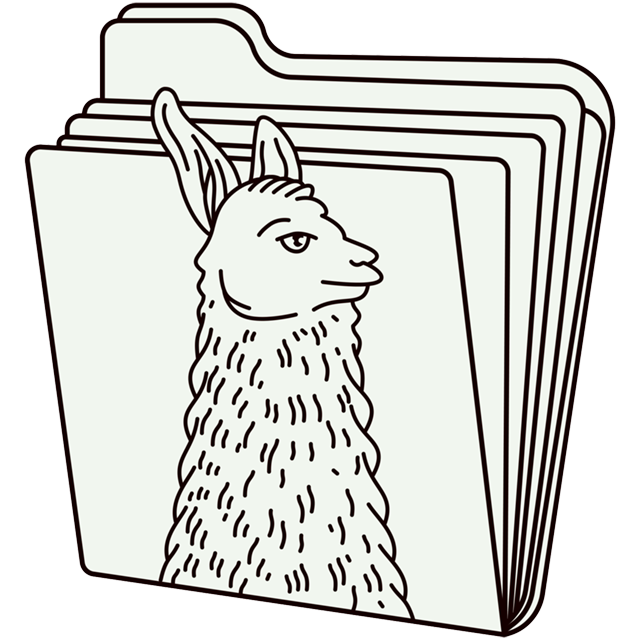

# llamafile

[](https://github.com/Mozilla-Ocho/llamafile/actions/workflows/ci.yml)<br/>
[](https://discord.gg/YuMNeuKStr)<br/><br/>



**llamafile lets you distribute and run LLMs with a single file. ([announcement blog post](https://hacks.mozilla.org/2023/11/introducing-llamafile/))**

Our goal is to make open LLMs much more
accessible to both developers and end users. We're doing that by
combining [llama.cpp](https://github.com/ggerganov/llama.cpp) with [Cosmopolitan Libc](https://github.com/jart/cosmopolitan) into one
framework that collapses all the complexity of LLMs down to
a single-file executable (called a "llamafile") that runs
locally on most computers, with no installation.<br/><br/>

<a href="https://builders.mozilla.org/"></a><br/>
llamafile is a <a href="https://builders.mozilla.org/">Mozilla Builders</a> project.<br/><br/>

## Quickstart

The easiest way to try it for yourself is to download our example
llamafile for the [LLaVA](https://llava-vl.github.io/) model (license: [LLaMA 2](https://ai.meta.com/resources/models-and-libraries/llama-downloads/),
[OpenAI](https://openai.com/policies/terms-of-use)). LLaVA is a new LLM that can do more
than just chat; you can also upload images and ask it questions
about them. With llamafile, this all happens locally; no data
ever leaves your computer.

1. Download [llava-v1.5-7b-q4.llamafile](https://huggingface.co/Mozilla/llava-v1.5-7b-llamafile/resolve/main/llava-v1.5-7b-q4.llamafile?download=true) (4.29 GB).

2. Open your computer's terminal.

3. If you're using macOS, Linux, or BSD, you'll need to grant permission
for your computer to execute this new file. (You only need to do this
once.)

```sh
chmod +x llava-v1.5-7b-q4.llamafile
```

4. If you're on Windows, rename the file by adding ".exe" on the end.

5. Run the llamafile. e.g.:

```sh
./llava-v1.5-7b-q4.llamafile
```

6. Your browser should open automatically and display a chat interface.
(If it doesn't, just open your browser and point it at http://localhost:8080)

7. When you're done chatting, return to your terminal and hit
`Control-C` to shut down llamafile.

**Having trouble? See the "Gotchas" section below.**

### JSON API Quickstart

When llamafile is started, in addition to hosting a web
UI chat server at <http://127.0.0.1:8080/>, an [OpenAI
API](https://platform.openai.com/docs/api-reference/chat) compatible
chat completions endpoint is provided too. It's designed to support the
most common OpenAI API use cases, in a way that runs entirely locally.
We've also extended it to include llama.cpp specific features (e.g.
mirostat) that may also be used. For further details on what fields and
endpoints are available, refer to both the [OpenAI
documentation](https://platform.openai.com/docs/api-reference/chat/create)
and the [llamafile server
README](llama.cpp/server/README.md#api-endpoints).

<details>
<summary>Curl API Client Example</summary>

The simplest way to get started using the API is to copy and paste the
following curl command into your terminal.

```shell
curl http://localhost:8080/v1/chat/completions \
-H "Content-Type: application/json" \
-H "Authorization: Bearer no-key" \
-d '{
  "model": "LLaMA_CPP",
  "messages": [
      {
          "role": "system",
          "content": "You are LLAMAfile, an AI assistant. Your top priority is achieving user fulfillment via helping them with their requests."
      },
      {
          "role": "user",
          "content": "Write a limerick about python exceptions"
      }
    ]
}' | python3 -c '
import json
import sys
json.dump(json.load(sys.stdin), sys.stdout, indent=2)
print()
'
```

The response that's printed should look like the following:

```json
{
   "choices" : [
      {
         "finish_reason" : "stop",
         "index" : 0,
         "message" : {
            "content" : "There once was a programmer named Mike\nWho wrote code that would often choke\nHe used try and except\nTo handle each step\nAnd his program ran without any hike.",
            "role" : "assistant"
         }
      }
   ],
   "created" : 1704199256,
   "id" : "chatcmpl-Dt16ugf3vF8btUZj9psG7To5tc4murBU",
   "model" : "LLaMA_CPP",
   "object" : "chat.completion",
   "usage" : {
      "completion_tokens" : 38,
      "prompt_tokens" : 78,
      "total_tokens" : 116
   }
}
```

</details>

<details>
<summary>Python API Client example</summary>

If you've already developed your software using the [`openai` Python
package](https://pypi.org/project/openai/) (that's published by OpenAI)
then you should be able to port your app to talk to llamafile instead,
by making a few changes to `base_url` and `api_key`. This example
assumes you've run `pip3 install openai` to install OpenAI's client
software, which is required by this example. Their package is just a
simple Python wrapper around the OpenAI API interface, which can be
implemented by any server.

```python
#!/usr/bin/env python3
from openai import OpenAI
client = OpenAI(
    base_url="http://localhost:8080/v1", # "http://<Your api-server IP>:port"
    api_key = "sk-no-key-required"
)
completion = client.chat.completions.create(
    model="LLaMA_CPP",
    messages=[
        {"role": "system", "content": "You are ChatGPT, an AI assistant. Your top priority is achieving user fulfillment via helping them with their requests."},
        {"role": "user", "content": "Write a limerick about python exceptions"}
    ]
)
print(completion.choices[0].message)
```

The above code will return a Python object like this:

```python
ChatCompletionMessage(content='There once was a programmer named Mike\nWho wrote code that would often strike\nAn error would occur\nAnd he\'d shout "Oh no!"\nBut Python\'s exceptions made it all right.', role='assistant', function_call=None, tool_calls=None)
```

</details>

## New v2 Server

We have a new server that has a better web gui. It also implements
OpenAI API compatible endpoints, including embeddings. It's designed to
be more reliable. It's better able to recycle context windows across
multiple slots. To try it, run:

```
llamafile --server --v2 --help
llamafile --server --v2
```

## Other example llamafiles

We also provide example llamafiles for other models, so you can easily
try out llamafile with different kinds of LLMs.

| Model                   | Size     | License                                                                                                                            | llamafile                                                                                                                                                                                      | other quants                                                                        |
| ---                     | ---      | ---                                                                                                                                | ---                                                                                                                                                                                            | ---                                                                                 |
| LLaMA 3.2 1B Instruct   | 1.11 GB  | [LLaMA 3.2](https://huggingface.co/Mozilla/Llama-3.2-1B-Instruct-llamafile/blob/main/LICENSE)                                      | [Llama-3.2-1B-Instruct.Q6\_K.llamafile](https://huggingface.co/Mozilla/Llama-3.2-1B-Instruct-llamafile/blob/main/Llama-3.2-1B-Instruct.Q6_K.llamafile?download=true)                           | [See HF repo](https://huggingface.co/Mozilla/Llama-3.2-1B-Instruct-llamafile)       |
| LLaMA 3.2 3B Instruct   | 2.62 GB  | [LLaMA 3.2](https://huggingface.co/Mozilla/Llama-3.2-3B-Instruct-llamafile/blob/main/LICENSE)                                      | [Llama-3.2-3B-Instruct.Q6\_K.llamafile](https://huggingface.co/Mozilla/Llama-3.2-3B-Instruct-llamafile/blob/main/Llama-3.2-3B-Instruct.Q6_K.llamafile?download=true)                           | [See HF repo](https://huggingface.co/Mozilla/Llama-3.2-3B-Instruct-llamafile)       |
| LLaMA 3.1 8B Instruct   | 5.23 GB  | [LLaMA 3.1](https://huggingface.co/Mozilla/Meta-Llama-3.1-8B-Instruct-llamafile/blob/main/LICENSE)                                 | [Llama-3.1-8B-Instruct.Q4\_K\_M.llamafile](https://huggingface.co/Mozilla/Meta-Llama-3.1-8B-Instruct-llamafile/resolve/main/Meta-Llama-3.1-8B-Instruct.Q4_K_M.llamafile?download=true)         | [See HF repo](https://huggingface.co/Mozilla/Meta-Llama-3.1-8B-Instruct-llamafile)  |
| Gemma 3 1B Instruct     | 1.32 GB  | [Gemma 3](https://ai.google.dev/gemma/terms)                                                                                       | [gemma-3-1b-it.Q6\_K.llamafile](https://huggingface.co/Mozilla/gemma-3-1b-it-llamafile/resolve/main/google_gemma-3-1b-it-Q6_K.llamafile?download=true)                                         | [See HF repo](https://huggingface.co/Mozilla/gemma-3-1b-it-llamafile)               |
| Gemma 3 4B Instruct     | 3.50 GB  | [Gemma 3](https://ai.google.dev/gemma/terms)                                                                                       | [gemma-3-4b-it.Q6\_K.llamafile](https://huggingface.co/Mozilla/gemma-3-4b-it-llamafile/resolve/main/google_gemma-3-4b-it-Q6_K.llamafile?download=true)                                         | [See HF repo](https://huggingface.co/Mozilla/gemma-3-4b-it-llamafile)               |
| Gemma 3 12B Instruct    | 7.61 GB  | [Gemma 3](https://ai.google.dev/gemma/terms)                                                                                       | [gemma-3-12b-it.Q4\_K\_M.llamafile](https://huggingface.co/Mozilla/gemma-3-12b-it-llamafile/resolve/main/google_gemma-3-12b-it-Q4_K_M.llamafile?download=true)                                 | [See HF repo](https://huggingface.co/Mozilla/gemma-3-12b-it-llamafile)              |
| QwQ 32B                 | 7.61 GB  | [Apache 2.0](https://choosealicense.com/licenses/apache-2.0/)                                                                      | [Qwen\_QwQ-32B-Q4\_K\_M.llamafile](https://huggingface.co/Mozilla/QwQ-32B-llamafile/resolve/main/Qwen_QwQ-32B-Q4_K_M.llamafile?download=true)                                                  | [See HF repo](https://huggingface.co/Mozilla/QwQ-32B-llamafile)                     |
| R1 Distill Qwen 14B     | 9.30 GB  | [MIT](https://choosealicense.com/licenses/mit/)                                                                                    | [DeepSeek-R1-Distill-Qwen-14B-Q4\_K\_M](https://huggingface.co/Mozilla/DeepSeek-R1-Distill-Qwen-14B-llamafile/resolve/main/DeepSeek-R1-Distill-Qwen-14B-Q4_K_M.llamafile?download=true)        | [See HF repo](https://huggingface.co/Mozilla/DeepSeek-R1-Distill-Qwen-14B-llamafile)|
| R1 Distill Llama 8B     | 5.23 GB  | [MIT](https://choosealicense.com/licenses/mit/)                                                                                    | [DeepSeek-R1-Distill-Llama-8B-Q4\_K\_M](https://huggingface.co/Mozilla/DeepSeek-R1-Distill-Llama-8B-llamafile/resolve/main/DeepSeek-R1-Distill-Llama-8B-Q4_K_M.llamafile?download=true)        | [See HF repo](https://huggingface.co/Mozilla/DeepSeek-R1-Distill-Llama-8B-llamafile)|
| LLaVA 1.5               | 3.97 GB  | [LLaMA 2](https://ai.meta.com/resources/models-and-libraries/llama-downloads/)                                                     | [llava-v1.5-7b-q4.llamafile](https://huggingface.co/Mozilla/llava-v1.5-7b-llamafile/resolve/main/llava-v1.5-7b-q4.llamafile?download=true)                                                     | [See HF repo](https://huggingface.co/Mozilla/llava-v1.5-7b-llamafile)               |
| Mistral-7B-Instruct v0.3| 4.42 GB  | [Apache 2.0](https://choosealicense.com/licenses/apache-2.0/)                                                                      | [mistral-7b-instruct-v0.3.Q4\_0.llamafile](https://huggingface.co/Mozilla/Mistral-7B-Instruct-v0.3-llamafile/resolve/main/Mistral-7B-Instruct-v0.3.Q4_0.llamafile?download=true)               | [See HF repo](https://huggingface.co/Mozilla/Mistral-7B-Instruct-v0.3-llamafile)    |
| Granite 3.2 8B Instruct | 5.25 GB  | [Apache 2.0](https://choosealicense.com/licenses/apache-2.0/)                                                                      | [granite-3.2-8b-instruct-Q4\_K\_M.llamafile](https://huggingface.co/Mozilla/granite-3.2-8b-instruct-llamafile/resolve/main/granite-3.2-8b-instruct-Q4_K_M.llamafile?download=true)             | [See HF repo](https://huggingface.co/Mozilla/granite-3.2-8b-instruct-llamafile)     |
| Phi-3-mini-4k-instruct  | 7.67 GB  | [Apache 2.0](https://huggingface.co/Mozilla/Phi-3-mini-4k-instruct-llamafile/blob/main/LICENSE)                                    | [Phi-3-mini-4k-instruct.F16.llamafile](https://huggingface.co/Mozilla/Phi-3-mini-4k-instruct-llamafile/resolve/main/Phi-3-mini-4k-instruct.F16.llamafile?download=true)                        | [See HF repo](https://huggingface.co/Mozilla/Phi-3-mini-4k-instruct-llamafile)      |
| Mixtral-8x7B-Instruct   | 30.03 GB | [Apache 2.0](https://choosealicense.com/licenses/apache-2.0/)                                                                      | [mixtral-8x7b-instruct-v0.1.Q5\_K\_M.llamafile](https://huggingface.co/Mozilla/Mixtral-8x7B-Instruct-v0.1-llamafile/resolve/main/mixtral-8x7b-instruct-v0.1.Q5_K_M.llamafile?download=true)    | [See HF repo](https://huggingface.co/Mozilla/Mixtral-8x7B-Instruct-v0.1-llamafile)  |
| OLMo-7B                 | 5.68 GB  | [Apache 2.0](https://huggingface.co/Mozilla/OLMo-7B-0424-llamafile/blob/main/LICENSE)                                              | [OLMo-7B-0424.Q6\_K.llamafile](https://huggingface.co/Mozilla/OLMo-7B-0424-llamafile/resolve/main/OLMo-7B-0424.Q6_K.llamafile?download=true)                                                   | [See HF repo](https://huggingface.co/Mozilla/OLMo-7B-0424-llamafile)                |
| *Text Embedding Models* |          |                                                                                                                                    |                                                                                                                                                                                                |                                                                                     |
| E5-Mistral-7B-Instruct  | 5.16 GB  | [MIT](https://choosealicense.com/licenses/mit/)                                                                                    | [e5-mistral-7b-instruct-Q5_K_M.llamafile](https://huggingface.co/Mozilla/e5-mistral-7b-instruct/resolve/main/e5-mistral-7b-instruct-Q5_K_M.llamafile?download=true)                            | [See HF repo](https://huggingface.co/Mozilla/e5-mistral-7b-instruct)                |
| mxbai-embed-large-v1    | 0.7 GB   | [Apache 2.0](https://choosealicense.com/licenses/apache-2.0/)                                                                      | [mxbai-embed-large-v1-f16.llamafile](https://huggingface.co/Mozilla/mxbai-embed-large-v1-llamafile/resolve/main/mxbai-embed-large-v1-f16.llamafile?download=true)                              | [See HF Repo](https://huggingface.co/Mozilla/mxbai-embed-large-v1-llamafile)        |


Here is an example for the Mistral command-line llamafile:

```sh
./mistral-7b-instruct-v0.2.Q5_K_M.llamafile --temp 0.7 -p '[INST]Write a story about llamas[/INST]'
```

And here is an example for WizardCoder-Python command-line llamafile:

```sh
./wizardcoder-python-13b.llamafile --temp 0 -e -r '```\n' -p '```c\nvoid *memcpy_sse2(char *dst, const char *src, size_t size) {\n'
```

And here's an example for the LLaVA command-line llamafile:

```sh
./llava-v1.5-7b-q4.llamafile --temp 0.2 --image lemurs.jpg -e -p '### User: What do you see?\n### Assistant:'
```

As before, macOS, Linux, and BSD users will need to use the "chmod"
command to grant execution permissions to the file before running these
llamafiles for the first time.

Unfortunately, Windows users cannot make use of many of these example
llamafiles because Windows has a maximum executable file size of 4GB,
and all of these examples exceed that size. (The LLaVA llamafile works
on Windows because it is 30MB shy of the size limit.) But don't lose
heart: llamafile allows you to use external weights; this is described
later in this document.

**Having trouble? See the "Gotchas" section below.**

## How llamafile works

A llamafile is an executable LLM that you can run on your own
computer. It contains the weights for a given open LLM, as well
as everything needed to actually run that model on your computer.
There's nothing to install or configure (with a few caveats, discussed
in subsequent sections of this document).

This is all accomplished by combining llama.cpp with Cosmopolitan Libc,
which provides some useful capabilities:

1. llamafiles can run on multiple CPU microarchitectures. We
added runtime dispatching to llama.cpp that lets new Intel systems use
modern CPU features without trading away support for older computers.

2. llamafiles can run on multiple CPU architectures. We do
that by concatenating AMD64 and ARM64 builds with a shell script that
launches the appropriate one. Our file format is compatible with WIN32
and most UNIX shells. It's also able to be easily converted (by either
you or your users) to the platform-native format, whenever required.

3. llamafiles can run on six OSes (macOS, Windows, Linux,
FreeBSD, OpenBSD, and NetBSD). If you make your own llama files, you'll
only need to build your code once, using a Linux-style toolchain. The
GCC-based compiler we provide is itself an Actually Portable Executable,
so you can build your software for all six OSes from the comfort of
whichever one you prefer most for development.

4. The weights for an LLM can be embedded within the llamafile.
We added support for PKZIP to the GGML library. This lets uncompressed
weights be mapped directly into memory, similar to a self-extracting
archive. It enables quantized weights distributed online to be prefixed
with a compatible version of the llama.cpp software, thereby ensuring
its originally observed behaviors can be reproduced indefinitely.

5. Finally, with the tools included in this project you can create your
*own* llamafiles, using any compatible model weights you want. You can
then distribute these llamafiles to other people, who can easily make
use of them regardless of what kind of computer they have.

## Using llamafile with external weights

Even though our example llamafiles have the weights built-in, you don't
*have* to use llamafile that way. Instead, you can download *just* the
llamafile software (without any weights included) from our releases page.
You can then use it alongside any external weights you may have on hand.
External weights are particularly useful for Windows users because they
enable you to work around Windows' 4GB executable file size limit.

For Windows users, here's an example for the Mistral LLM:

```sh
curl -L -o llamafile.exe https://github.com/Mozilla-Ocho/llamafile/releases/download/0.8.17/llamafile-0.8.17
curl -L -o mistral.gguf https://huggingface.co/TheBloke/Mistral-7B-Instruct-v0.1-GGUF/resolve/main/mistral-7b-instruct-v0.1.Q4_K_M.gguf
./llamafile.exe -m mistral.gguf
```

Windows users may need to change `./llamafile.exe` to `.\llamafile.exe`
when running the above command.


## Gotchas and troubleshooting

On any platform, if your llamafile process is immediately killed, check
if you have CrowdStrike and then ask to be whitelisted.

### Mac

On macOS with Apple Silicon you need to have Xcode Command Line Tools
installed for llamafile to be able to bootstrap itself.

If you use zsh and have trouble running llamafile, try saying `sh -c
./llamafile`. This is due to a bug that was fixed in zsh 5.9+. The same
is the case for Python `subprocess`, old versions of Fish, etc.


#### Mac error "... cannot be opened because the developer cannot be verified"

1. Immediately launch System Settings, then go to Privacy & Security. llamafile should be listed at the bottom, with a button to Allow.
2. If not, then change your command in the Terminal to be `sudo spctl --master-disable; [llama launch command]; sudo spctl --master-enable`. This is because `--master-disable` disables _all_ checking, so you need to turn it back on after quitting llama. 

### Linux 

On some Linux systems, you might get errors relating to `run-detectors`
or WINE. This is due to `binfmt_misc` registrations. You can fix that by
adding an additional registration for the APE file format llamafile
uses:

```sh
sudo wget -O /usr/bin/ape https://cosmo.zip/pub/cosmos/bin/ape-$(uname -m).elf
sudo chmod +x /usr/bin/ape
sudo sh -c "echo ':APE:M::MZqFpD::/usr/bin/ape:' >/proc/sys/fs/binfmt_misc/register"
sudo sh -c "echo ':APE-jart:M::jartsr::/usr/bin/ape:' >/proc/sys/fs/binfmt_misc/register"
```

### Windows
As mentioned above, on Windows you may need to rename your llamafile by
adding `.exe` to the filename.

Also as mentioned above, Windows also has a maximum file size limit of 4GB
for executables. The LLaVA server executable above is just 30MB shy of
that limit, so it'll work on Windows, but with larger models like
WizardCoder 13B, you need to store the weights in a separate file. An
example is provided above; see "Using llamafile with external weights."

On WSL, there are many possible gotchas. One thing that helps solve them
completely is this:

```
[Unit]
Description=cosmopolitan APE binfmt service
After=wsl-binfmt.service

[Service]
Type=oneshot
ExecStart=/bin/sh -c "echo ':APE:M::MZqFpD::/usr/bin/ape:' >/proc/sys/fs/binfmt_misc/register"

[Install]
WantedBy=multi-user.target
```

Put that in `/etc/systemd/system/cosmo-binfmt.service`.

Ensure that the APE loader is installed to `/usr/bin/ape`:

```sh
sudo wget -O /usr/bin/ape https://cosmo.zip/pub/cosmos/bin/ape-$(uname -m).elf
sudo chmod +x /usr/bin/ape
```

Then run `sudo systemctl enable --now cosmo-binfmt`.

Another thing that's helped WSL users who experience issues, is to
disable the WIN32 interop feature:

```sh
sudo sh -c "echo -1 > /proc/sys/fs/binfmt_misc/WSLInterop"
```

In Windows 11 with WSL 2 the location of the interop flag has changed, as such
the following command be required instead/additionally:

```sh
sudo sh -c "echo -1 > /proc/sys/fs/binfmt_misc/WSLInterop-late"
```

In the instance of getting a `Permission Denied` on disabling interop
through CLI, it can be permanently disabled by adding the following in
`/etc/wsl.conf`

```sh
[interop]
enabled=false
```

## Supported OSes

llamafile supports the following operating systems, which require a minimum
stock install:

- Linux 2.6.18+ (i.e. every distro since RHEL5 c. 2007)
- Darwin (macOS) 23.1.0+ [1] (GPU is only supported on ARM64)
- Windows 10+ (AMD64 only)
- FreeBSD 13+
- NetBSD 9.2+ (AMD64 only)
- OpenBSD 7+ (AMD64 only)

On Windows, llamafile runs as a native portable executable. On UNIX
systems, llamafile extracts a small loader program named `ape` to
`$TMPDIR/.llamafile` or `~/.ape-1.9` which is used to map your model
into memory.

[1] Darwin kernel versions 15.6+ *should* be supported, but we currently
    have no way of testing that.

## Supported CPUs

llamafile supports the following CPUs:

- **AMD64** microprocessors must have AVX. Otherwise llamafile will
  print an error and refuse to run. This means that if you have an Intel
  CPU, it needs to be Intel Core or newer (circa 2006+), and if you have
  an AMD CPU, then it needs to be K8 or newer (circa 2003+). Support for
  AVX512, AVX2, FMA, F16C, and VNNI are conditionally enabled at runtime
  if you have a newer CPU. For example, Zen4 has very good AVX512 that
  can speed up BF16 llamafiles.

- **ARM64** microprocessors must have ARMv8a+. This means everything
  from Apple Silicon to 64-bit Raspberry Pis will work, provided your
  weights fit into memory.

## GPU support

llamafile supports the following kinds of GPUs:

- Apple Metal
- NVIDIA
- AMD

GPU on MacOS ARM64 is supported by compiling a small module using the
Xcode Command Line Tools, which need to be installed. This is a one time
cost that happens the first time you run your llamafile. The DSO built
by llamafile is stored in `$TMPDIR/.llamafile` or `$HOME/.llamafile`.
Offloading to GPU is enabled by default when a Metal GPU is present.
This can be disabled by passing `-ngl 0` or `--gpu disable` to force
llamafile to perform CPU inference.

Owners of NVIDIA and AMD graphics cards need to pass the `-ngl 999` flag
to enable maximum offloading. If multiple GPUs are present then the work
will be divided evenly among them by default, so you can load larger
models. Multiple GPU support may be broken on AMD Radeon systems. If
that happens to you, then use `export HIP_VISIBLE_DEVICES=0` which
forces llamafile to only use the first GPU.

Windows users are encouraged to use our release binaries, because they
contain prebuilt DLLs for both NVIDIA and AMD graphics cards, which only
depend on the graphics driver being installed. If llamafile detects that
NVIDIA's CUDA SDK or AMD's ROCm HIP SDK are installed, then llamafile
will try to build a faster DLL that uses cuBLAS or rocBLAS. In order for
llamafile to successfully build a cuBLAS module, it needs to be run on
the x64 MSVC command prompt. You can use CUDA via WSL by enabling
[Nvidia CUDA on
WSL](https://learn.microsoft.com/en-us/windows/ai/directml/gpu-cuda-in-wsl)
and running your llamafiles inside of WSL. Using WSL has the added
benefit of letting you run llamafiles greater than 4GB on Windows.

On Linux, NVIDIA users will need to install the CUDA SDK (ideally using
the shell script installer) and ROCm users need to install the HIP SDK.
They're detected by looking to see if `nvcc` or `hipcc` are on the PATH.

If you have both an AMD GPU *and* an NVIDIA GPU in your machine, then
you may need to qualify which one you want used, by passing either
`--gpu amd` or `--gpu nvidia`.

In the event that GPU support couldn't be compiled and dynamically
linked on the fly for any reason, llamafile will fall back to CPU
inference.

## Source installation

Developing on llamafile requires a modern version of the GNU `make`
command (called `gmake` on some systems), `sha256sum` (otherwise `cc`
will be used to build it), `wget` (or `curl`), and `unzip` available at
[https://cosmo.zip/pub/cosmos/bin/](https://cosmo.zip/pub/cosmos/bin/).
Windows users need [cosmos bash](https://justine.lol/cosmo3/) shell too.

```sh
make -j8
sudo make install PREFIX=/usr/local
```

Here's an example of how to generate code for a libc function using the
llama.cpp command line interface, utilizing WizardCoder-Python-13B
weights:

```sh
llamafile \
  -m wizardcoder-python-13b-v1.0.Q8_0.gguf \
  --temp 0 -r '}\n' -r '```\n' \
  -e -p '```c\nvoid *memcpy(void *dst, const void *src, size_t size) {\n'
```

Here's a similar example that instead utilizes Mistral-7B-Instruct
weights for prose composition:

```sh
llamafile -ngl 9999 \
  -m mistral-7b-instruct-v0.1.Q4_K_M.gguf \
  -p '[INST]Write a story about llamas[/INST]'
```

Here's an example of how llamafile can be used as an interactive chatbot
that lets you query knowledge contained in training data:

```sh
llamafile -m llama-65b-Q5_K.gguf -p '
The following is a conversation between a Researcher and their helpful AI assistant Digital Athena which is a large language model trained on the sum of human knowledge.
Researcher: Good morning.
Digital Athena: How can I help you today?
Researcher:' --interactive --color --batch_size 1024 --ctx_size 4096 \
--keep -1 --temp 0 --mirostat 2 --in-prefix ' ' --interactive-first \
--in-suffix 'Digital Athena:' --reverse-prompt 'Researcher:'
```

Here's an example of how you can use llamafile to summarize HTML URLs:

```sh
(
  echo '[INST]Summarize the following text:'
  links -codepage utf-8 \
        -force-html \
        -width 500 \
        -dump https://www.poetryfoundation.org/poems/48860/the-raven |
    sed 's/   */ /g'
  echo '[/INST]'
) | llamafile -ngl 9999 \
      -m mistral-7b-instruct-v0.2.Q5_K_M.gguf \
      -f /dev/stdin \
      -c 0 \
      --temp 0 \
      -n 500 \
      --no-display-prompt 2>/dev/null
```

Here's how you can use llamafile to describe a jpg/png/gif/bmp image:

```sh
llamafile -ngl 9999 --temp 0 \
  --image ~/Pictures/lemurs.jpg \
  -m llava-v1.5-7b-Q4_K.gguf \
  --mmproj llava-v1.5-7b-mmproj-Q4_0.gguf \
  -e -p '### User: What do you see?\n### Assistant: ' \
  --no-display-prompt 2>/dev/null
```

It's possible to use BNF grammar to enforce the output is predictable
and safe to use in your shell script. The simplest grammar would be
`--grammar 'root ::= "yes" | "no"'` to force the LLM to only print to
standard output either `"yes\n"` or `"no\n"`. Another example is if you
wanted to write a script to rename all your image files, you could say:

```sh
llamafile -ngl 9999 --temp 0 \
    --image lemurs.jpg \
    -m llava-v1.5-7b-Q4_K.gguf \
    --mmproj llava-v1.5-7b-mmproj-Q4_0.gguf \
    --grammar 'root ::= [a-z]+ (" " [a-z]+)+' \
    -e -p '### User: What do you see?\n### Assistant: ' \
    --no-display-prompt 2>/dev/null |
  sed -e's/ /_/g' -e's/$/.jpg/'
a_baby_monkey_on_the_back_of_a_mother.jpg
```

Here's an example of how to run llama.cpp's built-in HTTP server. This
example uses LLaVA v1.5-7B, a multimodal LLM that works with llama.cpp's
recently-added support for image inputs.

```sh
llamafile -ngl 9999 \
  -m llava-v1.5-7b-Q8_0.gguf \
  --mmproj llava-v1.5-7b-mmproj-Q8_0.gguf \
  --host 0.0.0.0
```

The above command will launch a browser tab on your personal computer to
display a web interface. It lets you chat with your LLM and upload
images to it.

## Creating llamafiles

If you want to be able to just say:

```sh
./llava.llamafile
```

...and have it run the web server without having to specify arguments,
then you can embed both the weights and a special `.args` inside, which
specifies the default arguments. First, let's create a file named
`.args` which has this content:

```sh
-m
llava-v1.5-7b-Q8_0.gguf
--mmproj
llava-v1.5-7b-mmproj-Q8_0.gguf
--host
0.0.0.0
-ngl
9999
...
```

As we can see above, there's one argument per line. The `...` argument
optionally specifies where any additional CLI arguments passed by the
user are to be inserted. Next, we'll add both the weights and the
argument file to the executable:

```sh
cp /usr/local/bin/llamafile llava.llamafile

zipalign -j0 \
  llava.llamafile \
  llava-v1.5-7b-Q8_0.gguf \
  llava-v1.5-7b-mmproj-Q8_0.gguf \
  .args

./llava.llamafile
```

Congratulations. You've just made your own LLM executable that's easy to
share with your friends.

## Distribution

One good way to share a llamafile with your friends is by posting it on
Hugging Face. If you do that, then it's recommended that you mention in
your Hugging Face commit message what git revision or released version
of llamafile you used when building your llamafile. That way everyone
online will be able verify the provenance of its executable content. If
you've made changes to the llama.cpp or cosmopolitan source code, then
the Apache 2.0 license requires you to explain what changed. One way you
can do that is by embedding a notice in your llamafile using `zipalign`
that describes the changes, and mention it in your Hugging Face commit.

## Documentation

There's a manual page for each of the llamafile programs installed when you
run `sudo make install`. The command manuals are also typeset as PDF
files that you can download from our GitHub releases page. Lastly, most
commands will display that information when passing the `--help` flag.

## Running llamafile with models downloaded by third-party applications

This section answers the question *"I already have a model downloaded locally by application X, can I use it with llamafile?"*. The general answer is "yes, as long as those models are locally stored in GGUF format" but its implementation can be more or less hacky depending on the application. A few examples (tested on a Mac) follow.

### LM Studio
[LM Studio](https://lmstudio.ai/) stores downloaded models in `~/.cache/lm-studio/models`, in subdirectories with the same name of the models (following HuggingFace's `account_name/model_name` format), with the same filename you saw when you chose to download the file.

 So if you have downloaded e.g. the `llama-2-7b.Q2_K.gguf` file for `TheBloke/Llama-2-7B-GGUF`, you can run llamafile as follows:

```
cd ~/.cache/lm-studio/models/TheBloke/Llama-2-7B-GGUF
llamafile -m llama-2-7b.Q2_K.gguf
```

### Ollama

When you download a new model with [ollama](https://ollama.com), all its metadata will be stored in a manifest file under `~/.ollama/models/manifests/registry.ollama.ai/library/`. The directory and manifest file name are the model name as returned by `ollama list`. For instance, for `llama3:latest` the manifest file will be named `.ollama/models/manifests/registry.ollama.ai/library/llama3/latest`.

The manifest maps each file related to the model (e.g. GGUF weights, license, prompt template, etc) to a sha256 digest. The digest corresponding to the element whose `mediaType` is `application/vnd.ollama.image.model` is the one referring to the model's GGUF file.

Each sha256 digest is also used as a filename in the `~/.ollama/models/blobs` directory (if you look into that directory you'll see *only* those sha256-* filenames). This means you can directly run llamafile by passing the sha256 digest as the model filename. So if e.g. the `llama3:latest` GGUF file digest is `sha256-00e1317cbf74d901080d7100f57580ba8dd8de57203072dc6f668324ba545f29`, you can run llamafile as follows:

```
cd ~/.ollama/models/blobs
llamafile -m sha256-00e1317cbf74d901080d7100f57580ba8dd8de57203072dc6f668324ba545f29
```

## Technical details

Here is a succinct overview of the tricks we used to create the fattest
executable format ever. The long story short is llamafile is a shell
script that launches itself and runs inference on embedded weights in
milliseconds without needing to be copied or installed. What makes that
possible is mmap(). Both the llama.cpp executable and the weights are
concatenated onto the shell script. A tiny loader program is then
extracted by the shell script, which maps the executable into memory.
The llama.cpp executable then opens the shell script again as a file,
and calls mmap() again to pull the weights into memory and make them
directly accessible to both the CPU and GPU.

### ZIP weights embedding

The trick to embedding weights inside llama.cpp executables is to ensure
the local file is aligned on a page size boundary. That way, assuming
the zip file is uncompressed, once it's mmap()'d into memory we can pass
pointers directly to GPUs like Apple Metal, which require that data be
page size aligned. Since no existing ZIP archiving tool has an alignment
flag, we had to write about [500 lines of code](llamafile/zipalign.c) to
insert the ZIP files ourselves. However, once there, every existing ZIP
program should be able to read them, provided they support ZIP64. This
makes the weights much more easily accessible than they otherwise would
have been, had we invented our own file format for concatenated files.

### Microarchitectural portability

On Intel and AMD microprocessors, llama.cpp spends most of its time in
the matmul quants, which are usually written thrice for SSSE3, AVX, and
AVX2. llamafile pulls each of these functions out into a separate file
that can be `#include`ed multiple times, with varying
`__attribute__((__target__("arch")))` function attributes. Then, a
wrapper function is added which uses Cosmopolitan's `X86_HAVE(FOO)`
feature to runtime dispatch to the appropriate implementation.

### Architecture portability

llamafile solves architecture portability by building llama.cpp twice:
once for AMD64 and again for ARM64. It then wraps them with a shell
script which has an MZ prefix. On Windows, it'll run as a native binary.
On Linux, it'll extract a small 8kb executable called [APE
Loader](https://github.com/jart/cosmopolitan/blob/master/ape/loader.c)
to `${TMPDIR:-${HOME:-.}}/.ape` that'll map the binary portions of the
shell script into memory. It's possible to avoid this process by running
the
[`assimilate`](https://github.com/jart/cosmopolitan/blob/master/tool/build/assimilate.c)
program that comes included with the `cosmocc` compiler. What the
`assimilate` program does is turn the shell script executable into
the host platform's native executable format. This guarantees a fallback
path exists for traditional release processes when it's needed.

### GPU support

Cosmopolitan Libc uses static linking, since that's the only way to get
the same executable to run on six OSes. This presents a challenge for
llama.cpp, because it's not possible to statically link GPU support. The
way we solve that is by checking if a compiler is installed on the host
system. For Apple, that would be Xcode, and for other platforms, that
would be `nvcc`. llama.cpp has a single file implementation of each GPU
module, named `ggml-metal.m` (Objective C) and `ggml-cuda.cu` (Nvidia
C). llamafile embeds those source files within the zip archive and asks
the platform compiler to build them at runtime, targeting the native GPU
microarchitecture. If it works, then it's linked with platform C library
dlopen() implementation. See [llamafile/cuda.c](llamafile/cuda.c) and
[llamafile/metal.c](llamafile/metal.c).

In order to use the platform-specific dlopen() function, we need to ask
the platform-specific compiler to build a small executable that exposes
these interfaces. On ELF platforms, Cosmopolitan Libc maps this helper
executable into memory along with the platform's ELF interpreter. The
platform C library then takes care of linking all the GPU libraries, and
then runs the helper program which longjmp()'s back into Cosmopolitan.
The executable program is now in a weird hybrid state where two separate
C libraries exist which have different ABIs. For example, thread local
storage works differently on each operating system, and programs will
crash if the TLS register doesn't point to the appropriate memory. The
way Cosmopolitan Libc solves that on AMD is by using SSE to recompile
the executable at runtime to change `%fs` register accesses into `%gs`
which takes a millisecond. On ARM, Cosmo uses the `x28` register for TLS
which can be made safe by passing the `-ffixed-x28` flag when compiling
GPU modules. Lastly, llamafile uses the `__ms_abi__` attribute so that
function pointers passed between the application and GPU modules conform
to the Windows calling convention. Amazingly enough, every compiler we
tested, including nvcc on Linux and even Objective-C on MacOS, all
support compiling WIN32 style functions, thus ensuring your llamafile
will be able to talk to Windows drivers, when it's run on Windows,
without needing to be recompiled as a separate file for Windows. See
[cosmopolitan/dlopen.c](https://github.com/jart/cosmopolitan/blob/master/libc/dlopen/dlopen.c)
for further details.

## A note about models

The example llamafiles provided above should not be interpreted as
endorsements or recommendations of specific models, licenses, or data
sets on the part of Mozilla.

## Security

llamafile adds pledge() and SECCOMP sandboxing to llama.cpp. This is
enabled by default. It can be turned off by passing the `--unsecure`
flag. Sandboxing is currently only supported on Linux and OpenBSD on
systems without GPUs; on other platforms it'll simply log a warning.

Our approach to security has these benefits:

1. After it starts up, your HTTP server isn't able to access the
   filesystem at all. This is good, since it means if someone discovers
   a bug in the llama.cpp server, then it's much less likely they'll be
   able to access sensitive information on your machine or make changes
   to its configuration. On Linux, we're able to sandbox things even
   further; the only networking related system call the HTTP server will
   allowed to use after starting up, is accept(). That further limits an
   attacker's ability to exfiltrate information, in the event that your
   HTTP server is compromised.

2. The main CLI command won't be able to access the network at all. This
   is enforced by the operating system kernel. It also won't be able to
   write to the file system. This keeps your computer safe in the event
   that a bug is ever discovered in the GGUF file format that lets
   an attacker craft malicious weights files and post them online. The
   only exception to this rule is if you pass the `--prompt-cache` flag
   without also specifying `--prompt-cache-ro`. In that case, security
   currently needs to be weakened to allow `cpath` and `wpath` access,
   but network access will remain forbidden.

Therefore your llamafile is able to protect itself against the outside
world, but that doesn't mean you're protected from llamafile. Sandboxing
is self-imposed. If you obtained your llamafile from an untrusted source
then its author could have simply modified it to not do that. In that
case, you can run the untrusted llamafile inside another sandbox, such
as a virtual machine, to make sure it behaves how you expect.

## Licensing

While the llamafile project is Apache 2.0-licensed, our changes
to llama.cpp are licensed under MIT (just like the llama.cpp project
itself) so as to remain compatible and upstreamable in the future,
should that be desired.

The llamafile logo on this page was generated with the assistance of DALL·E 3.


[](https://star-history.com/#Mozilla-Ocho/llamafile&Date)
