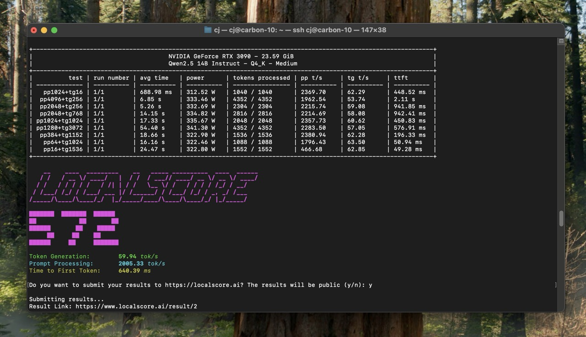

# LocalScore

LocalScore is an open-source benchmarking tool designed to measure how fast Large Language Models (LLMs) run on your specific hardware. It also provides a public database for benchmark results, helping you make informed decisions about running AI models locally.

You can view the leaderboard at [localscore.ai](https://localscore.ai)



<p align="center">
<i>
<br />
<a href="https://builders.mozilla.org/"></a><br/>
<a href="https://localscore.ai">LocalScore</a> is a <a href="https://builders.mozilla.org/">Mozilla Builders</a> project.
</i>
</p>

## Features

- **Comprehensive Performance Metrics**: Measures prompt processing speed, generation speed, and time to first token
- **Hardware Support**: Works with CPUs, NVIDIA GPUs, AMD GPUs, and Apple Silicon
- **Result Sharing**: Optional submission of benchmark results to a public database at [localscore.ai](https://localscore.ai)
- **Cross-Platform**: Works on Windows, macOS, and Linux

## What LocalScore Measures

LocalScore evaluates three key performance metrics:

1. **Prompt Processing Speed**: How quickly your system processes input text (tokens per second)
2. **Generation Speed**: How fast your system generates new text (tokens per second)
3. **Time to First Token**: The latency before the first response appears (milliseconds)

These metrics are combined into a single **LocalScore** value using a geometric mean:

$`\text{score} = 10 \cdot \sqrt[3]{\text{avg\_prompt\_tps} \cdot \text{avg\_gen\_tps} \cdot \frac{1000}{\text{avg\_ttft\_ms}}}`$

As a general guideline:
- A score of 1,000+ is excellent
- A score of 250 is acceptable to good for most people
- A score of 100 is relatively poor

## Running LocalScore

There are four primary ways to run LocalScore. The first two are covered on the [LocalScore download page](https://localscore.ai/download). 

In addition to the following instructions, you can always build from source. For that case please follow the [Llamafile build instructions](https://github.com/Mozilla-Ocho/llamafile).

### Option 1: Download and Run a LocalScore Bundle

The LocalScore bundle include the LocalScore binary and a model inside of it.

Visit [localscore.ai](https://localscore.ai/download) to get the current bundles.

### Option 2: Download the LocalScore release directly

Download the appropriate binary for your operating system:
[Latest Release Download Page](https://github.com/Mozilla-Ocho/llamafile/releases/latest)

#### MacOS/Linux
```bash
chmod +x localscore
./localscore -m path/to/model.gguf
```

#### Windows
```powershell
localscore.exe -m path\to\model.gguf
```

### Option 3: Download a Llamafile bundle

Every new llamafile (>=v0.9.2) contains commands to run LocalScore.

Example:

#### MacOS/Linux
```bash
# Download a llamafile from Hugging Face
curl -O https://huggingface.co/Mozilla/Llama-3.2-1B-Instruct-llamafile/resolve/main/Llama-3.2-1B-Instruct.Q4_K_M.llamafile

# Run LocalScore
chmod +x Llama-3.2-1B-Instruct.Q4_K_M.llamafile
./Llama-3.2-1B-Instruct.Q4_K_M.llamafile --bench
```

#### Windows
Download any llamafile smaller than 4GB from Hugging Face and run it.
```powershell
Llama-3.2-1B-Instruct.Q4_K_M.llamafile.exe --bench
```

### Option 4: Run LocalScore from Llamafile

If you have Llamafile installed, you can run LocalScore directly from it.

#### MacOS/Linux

```bash
# Run LocalScore
llamafile --bench -m path/to/model.gguf
```

#### Windows

```powershell
llamafile.exe --bench -m path\to\model.gguf
```

### Command Line Options

```
usage: localscore [options]

options:
  -h, --help                                 Show this help message
  -m, --model <filename>                     Model to benchmark (default: path/to/default)
  -c, --cpu                                  Disable GPU acceleration (alias for --gpu=disabled)
  -g, --gpu <auto|amd|apple|nvidia|disabled> GPU backend to use (default: "auto")
  -i, --gpu-index <i>                        Select GPU by index (default: 0)
  --list-gpus                                List available GPUs and exit
  -o, --output <csv|json|md>                 Output format (default: md)
  -v, --verbose                              Enable verbose output
  -y, --send-results                         Send results without confirmation
  -n, --no-send-results                      Disable sending results
  -e, --extended                             Run 4 repetitions (shortcut for --reps=4)
  --long                                     Run 16 repetitions (shortcut for --reps=16)
  --reps <N>                                 Set custom number of repetitions
```

#### Running with CPU Only

```bash
./localscore -m path/to/model.gguf --cpu
```

#### Send Results Automatically

```bash
./localscore -m path/to/model.gguf -y
```

#### Run Each Test 4 Times

```bash
./localscore -m path/to/model.gguf -e
```

## Data Collection

When you submit benchmark results to localscore.ai, the following non-personally identifiable system information is collected:

- CPU model and configuration
- GPU model and configuration
- Operating system and version
- RAM amount
- Benchmark performance metrics

This data helps build a comprehensive database of hardware performance for LLM inference, allowing users to compare different setups and make informed decisions.

## Limitations

- **Windows File Size**: Due to Windows limitations, llamafile's larger than 4GB will not run directly. Windows users should use LocalScore as a standalone utility and pass in models in GGUF format.
- **Single-GPU Focus**: Currently, LocalScore only supports single-GPU setups, which represents the most practical approach for most users running LLMs locally.
- **Early Development**: LocalScore is in relatively early development, so you may encounter occasional issues. Please file a GitHub issue if you encounter any problems.

## Troubleshooting

Check out the [Troubleshooting](https://github.com/Mozilla-Ocho/llamafile/blob/main/localscore/doc/troubleshooting.md) doc for common issues and solutions.

## Contributing

Contributions are welcome! See the main [Llamafile README](https://github.com/Mozilla-Ocho/llamafile) for building instructions and development guidelines.

## Acknowledgements

LocalScore was created with support from [Mozilla Builders](https://builders.mozilla.org/) and builds upon the excellent work of:
- [llama.cpp](https://github.com/ggml-org/llama.cpp)
- [Llamafile](https://github.com/Mozilla-Ocho/llamafile)

## License

LocalScore is released under the [MIT License](LICENSE).

## Links

- [Official Website](https://localscore.ai)
- [GitHub Repository](localscore)
- [Issue Tracker](https://github.com/Mozilla-Ocho/llamafile/issues)
